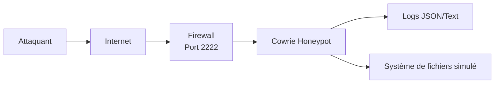

# Architecture du Honeypot Cowrie

## Vue d'ensemble
Ce document décrit l'architecture technique du déploiement de notre honeypot Cowrie.

## Composants
1. **Cowrie Honeypot** - Logiciel principal simulant un système SSH
2. **Système de logging** - Collecte et stockage des événements
3. **Scripts d'analyse** - Traitement et analyse des données

## Diagramme d'architecture

### Description des composants
***Attaquant***: L'entité malveillante qui initie les connexions SSH/Telnet.
***Internet***: Le réseau public par lequel transitent les connexions.
***Firewall***: Le dispositif qui autorise les connexions sur le port 2222 vers le honeypot.
***Cowrie Honeypot***: Le logiciel qui simule un serveur SSH/Telnet et capture les activités.
***Logs JSON/Text***: Les fichiers de logs générés par Cowrie pour analyse.
***Système de fichiers simulé***: L'environnement fictif dans lequel l'attaquant évolue.

## Flux de données
1. Un attaquant scanne les IPs publiques pour le port SSH
2. La connexion est redirigée vers Cowrie sur le port 2222
3. Cowrie simule un shell bash et enregistre toutes les interactions
4. Les données sont sauvegardées dans des fichiers logs et une base SQLite
5. Les scripts d'analyse traitent les logs pour générer des rapports

## Sécurité
- Cowrie fonctionne sous un utilisateur dédié sans privilèges
- Isolation du système hôte via environnement virtualisé
- Logs stockés avec permissions restrictives
- Aucune donnée sensible exposée dans le honeypot
